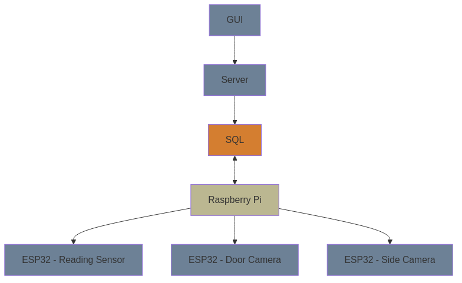

# IOT-Smart-fridge-backend

## Dev Boards we use 

* [Devboard MainBoard](https://www.raspberrypi.com/products/raspberry-pi-5/)
* [Cheaper Option](https://www.raspberrypi.com/)
  * [Sensor Units](https://www.espressif.com/en/products/socs/esp32)
   #### Components
   * [Door Sensor](https://www.kjell.com/se/produkter/smarta-hem/smarta-sensorer/smarta-magnetkontakter/tp-link-tapo-t110-magnetsensor-p65257)


*** ***

## Features

* Real-time inventory tracking
* Weight-based food quantity estimation
* Temperature and sensor monitoring
* Expiration date tracking
* Recipe suggestions based on available ingredients

## Dependencies
* [poetry](https://python-poetry.org/)
* [flask](https://flask.palletsprojects.com/en/stable/)
* [pytest](https://docs.pytest.org/en/stable/)


*** ***


### Hardware Setup

1. **Rasberry Pi with Front Display**: Mounted on the fridge door, serves as the main control unit and has a interactable UI for ease of use 
2. **Multiple ESP32 Inside the Fridge**: Manages internal sensors and cameras

### Components List


* Rasberry Pi (with touchscreen display)
* ESP32 development board
* Various sensors (temperature, door sensor, weight sensor)
* Camera module
* Power supply units


*** ***


### The system uses a client-server model

* **ESP32 (Client)**: Collects sensor data and camera feeds, sends to raspberry pi
* **Raspberry Pi (Server)**: Processes data, manages display and hosts the API


*** *** 


### Installation
```
git clone https://github.com/ghosthookcc/IOT-Smart-fridge-backend.git
cd IOT-Smart-fridge-backend/smart-fridge
pipx poetry
poetry install
```

### How to run different services 
```
cd IOT-Smart-fridge-backend/smart-fridge
```
```
poetry run api
```
```
poetry run screen
```

### How to run tests
```
cd IOT-Smart-fridge-backend/smart-fridge
poetry run pytest
```

### Communication Architecture
* **TCP** sockets for data transfer between ESP32 and Raspberry Pi
* **REST**less for external integrations



