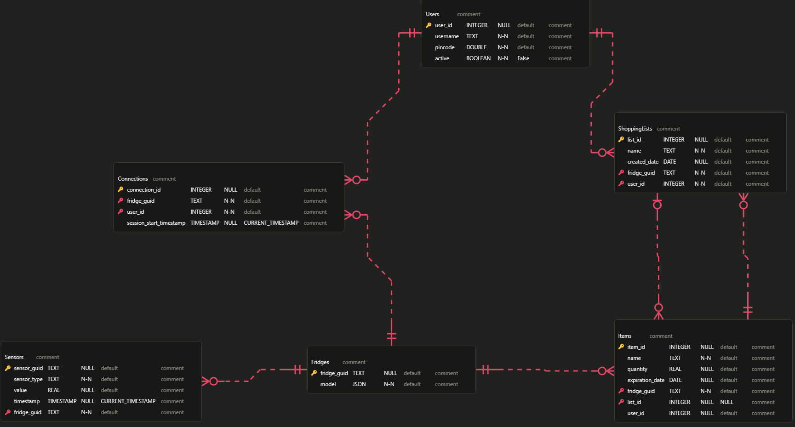

# IOT-Smart-fridge-backend

## Dev Boards we use 

* [Devboard MainBoard](https://www.raspberrypi.com/products/raspberry-pi-5/)
* [Cheaper Option](https://www.raspberrypi.com/)
* [Sensor Units](https://www.espressif.com/en/products/socs/esp32)
### Components
* [Door Sensor](https://www.kjell.com/se/produkter/smarta-hem/smarta-sensorer/smarta-magnetkontakter/tp-link-tapo-t110-magnetsensor-p65257)
* [Hall Sensor](https://www.elfa.se/sv/givare/hall-och-reed-sensorer/halleffektsensorer/c/cat-DNAV_PL_130601)
* [Display](https://www.amazon.se/s?k=Raspberry+Pi+Screen+7+inch+DSI+Touch+Screen&crid=3PAK537A9J8W&sprefix=raspberry+pi+screen+7+inch+dsi+touch+screen%2Caps%2C117&ref=nb_sb_noss)
* [Camera](https://www.electrokit.com/en/esp32-cam-utvecklingskort-med-wifi-och-kamera)
* [Resistors & jump wires](https://www.digikey.se/?gclsrc=aw.ds&&utm_adgroup=General&utm_source=google&utm_medium=cpc&utm_campaign=SE_Brand_Digi-Key&utm_term=digikey&productid=&utm_content=General&utm_id=go_cmp-237650306_adg-13837730786_ad-535737722073_kwd-13013986_dev-c_ext-_prd-_sig-Cj0KCQiA4-y8BhC3ARIsAHmjC_HThvmMRlUaWEhMMsr9w_Qud-Xe6K-GQS8t3ySLGSlWILlTkvvRQnoaAhxAEALw_wcB&gad_source=1&gclid=Cj0KCQiA4-y8BhC3ARIsAHmjC_HThvmMRlUaWEhMMsr9w_Qud-Xe6K-GQS8t3ySLGSlWILlTkvvRQnoaAhxAEALw_wcB&gclsrc=aw.ds)


*** ***

## Features

* Real-time inventory tracking
* Weight-based food quantity estimation
* Temperature and sensor monitoring
* Expiration date tracking
* Recipe suggestions based on available ingredients

## Dependencies
* [pipx](https://github.com/pypa/pipx)
* [poetry](https://python-poetry.org/)
* [flask](https://flask.palletsprojects.com/en/stable/)
* [flask-sqlalchemy](https://flask-sqlalchemy.readthedocs.io/en/stable/)
* [flask-restful](https://flask-restful.readthedocs.io/en/latest/)
* [pytest](https://docs.pytest.org/en/stable/)
* [sqlite3](https://www.sqlite.org/)
* [importlib](https://docs.python.org/3/library/importlib.html)
* [jsonmerge](https://pypi.org/project/jsonmerge/)


*** ***


### Hardware Setup

1. **Rasberry Pi with Front Display**: Mounted on the fridge door, serves as the main control unit and has a interactable UI for ease of use 
2. **Multiple ESP32 Inside the Fridge**: Manages internal sensors and cameras

### Components List


* Rasberry Pi (with touchscreen display)
* ESP32 development board
* Various sensors (temperature, door sensor, weight sensor)
* Camera module
* Power supply units


*** ***


### The system uses a client-server model

* **ESP32 (Client)**: Collects sensor data and camera feeds, sends to raspberry pi
* **Raspberry Pi (Server)**: Processes data, manages display and hosts the API


*** *** 


### Installation
```
git clone https://github.com/ghosthookcc/IOT-Smart-fridge-backend.git
cd IOT-Smart-fridge-backend/smart-fridge
pipx install poetry
poetry install
```

### How to run different services 
```
cd IOT-Smart-fridge-backend/smart-fridge
```

| Command                       | Action                    |
| :---------------------------  | :------------------------ |
| `poetry run restless-service` | Starts the restless api   |
| `poetry run screen-service`   | Starts the screen manager |
| `poetry run receiver-service` | Starts the data receiver  |


### How to run tests
```
cd IOT-Smart-fridge-backend/smart-fridge
poetry run pytest
```


*** ***


### Communication Architecture
* **TCP** sockets for data transfer between ESP32 and Raspberry Pi
* **REST**less for external integrations


*** ***


### Database Structure


