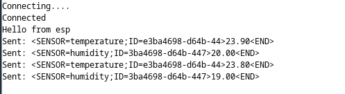

# ESP8266 Arduino Sensor Setup

### 1. Add ESP8266 Board Manager URL
1. Open arduino IDE
2. Go to **File > Preferences**.
3. In "Additional Boards Manager URLs" field, add this URL:

```
https://arduino.esp8266.com/stable/package_esp8266com_index.json 
```


### 2. Install Required Libraries
1. Go to **Tools > Manage Libraries**.
2. Search for & install
- **WebsSockets** by Markus Sattler
- **DHT Sensor** by Adafruit


### 3. Select and install ESP8266 library

1. Got to **Tools > Board**.
2. Select NodeMCU ESP-12E Module   


### Testing





*** ***


*** ***


